# Диаграммы проекта

Mermaid-диаграммы (классы и последовательности) находятся в этом файле и рендерятся
GitHub автоматически. C4-диаграммы — в файлах `c4-context.puml`, `c4-container.puml`,
`c4-component.puml` (PlantUML + C4-PlantUML); инструкция по рендерингу — [в конце файла](#рендеринг-c4-диаграмм).

---

## 1. Диаграммы классов (один паттерн — одна диаграмма)

### 1.1. Наблюдатель / Издатель–Подписчик — потоковая доставка данных

Два конвейера событий построены на `Sinks.Many` (multicast, direct best-effort):
измерения идут через PostgreSQL LISTEN/NOTIFY, инциденты публикуются напрямую
генератором. Браузер подписывается на оба через SSE.

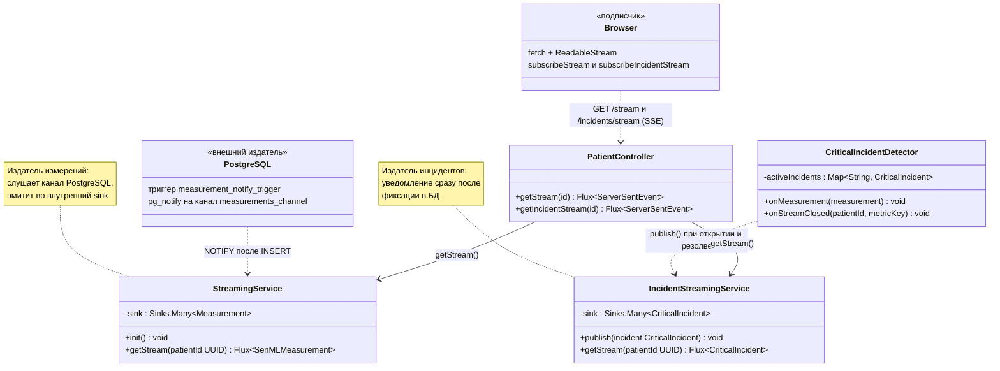

### 1.2. Команда + Стратегия — эмулятор датчиков

`MetricGeneratorTask` — Команда (инкапсулированная работа, выполняемая на
виртуальном потоке), `MetricGenerationEngine` — инициатор с реестром активных
задач. Формула генерации значения выделена в Стратегию `ValueGenerator`.
Единственная связь эмулятора с системой мониторинга — вызов
`MeasurementIngestService` (см. 1.5).

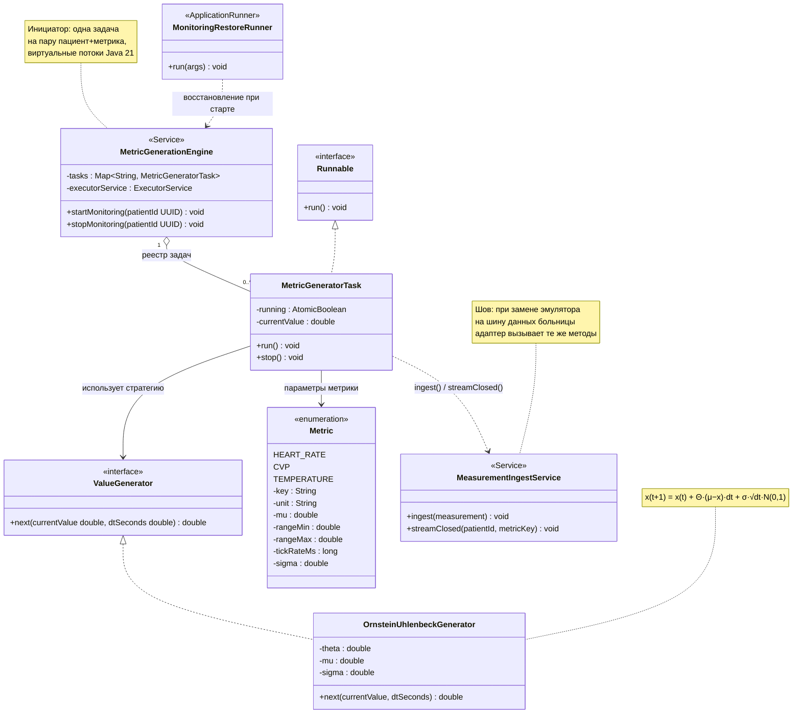

### 1.5. Фасад приёма измерений — шов источника данных

`MeasurementIngestService` — Фасад: «измерение вошло в систему» = сохранение
в БД + детекция инцидентов. `CriticalIncidentDetector` — правило предметной
области, отвязанное от происхождения данных: при замене эмулятора на
реальную шину больницы детекция продолжает работать без изменений.

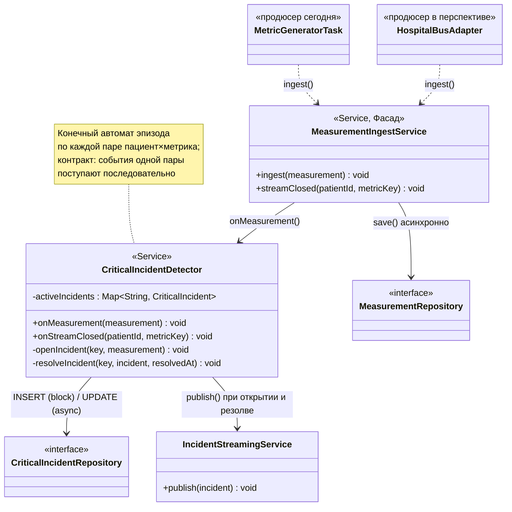

### 1.3. Репозиторий + Persistable — слой доступа к данным

Все сущности с UUID-идентификаторами реализуют `Persistable`, поскольку UUIDv7
присваивается в коде приложения: без этого Spring Data R2DBC принимал бы
непустой `@Id` за признак существующей записи и выполнял UPDATE вместо INSERT.

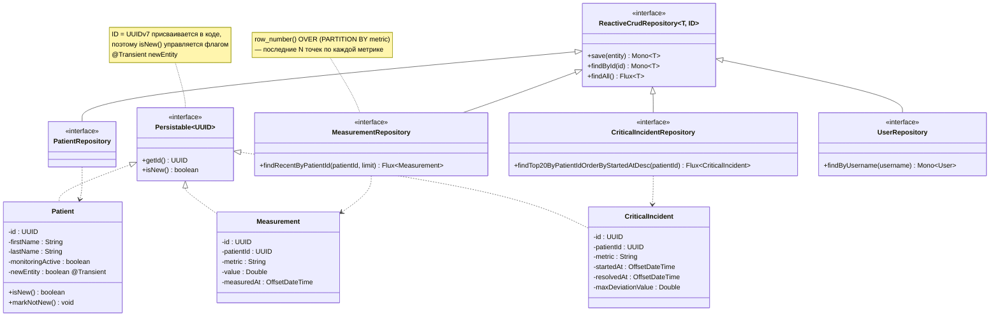

### 1.4. Стратегия (точки расширения Spring Security) — JWT-аутентификация

Собственные реализации подменяют стандартное поведение цепочки фильтров
WebFlux Security: извлечение контекста из заголовка Bearer и проверка JWT.

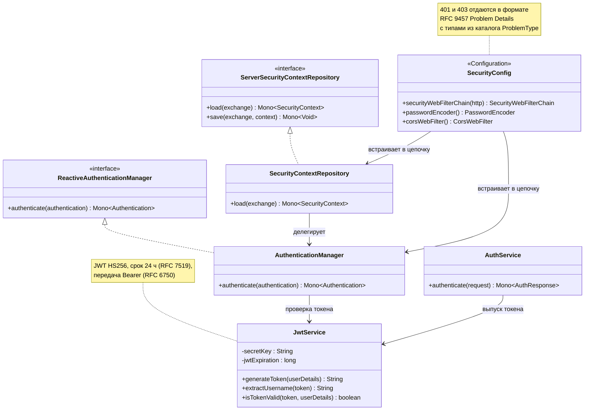

---

## 2. Диаграммы последовательности

### 2.1. Получение JWT-токена

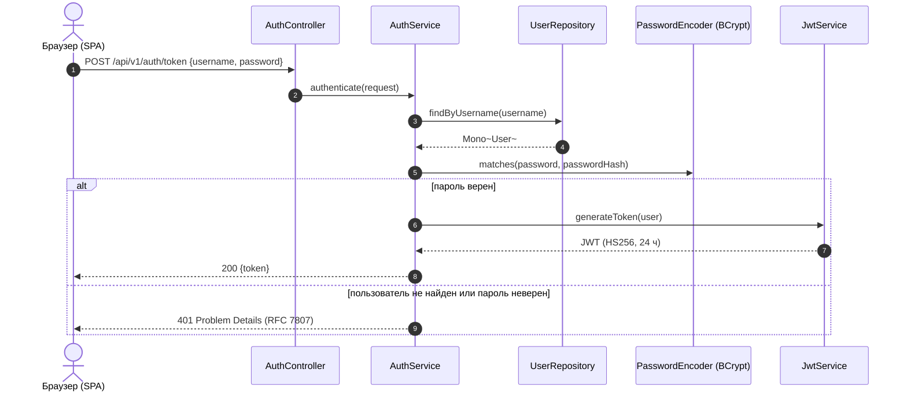

### 2.2. Доступ к защищённому ресурсу

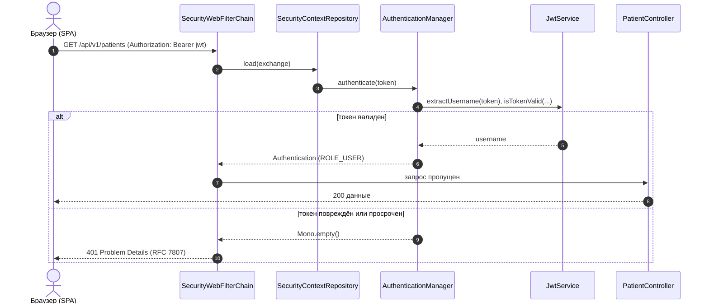

### 2.3. Старт мониторинга и поток измерений в реальном времени

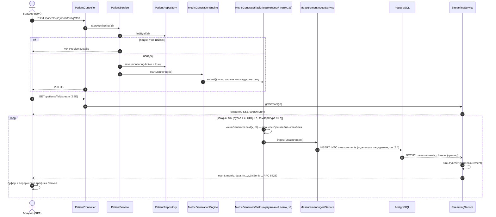

### 2.4. Жизненный цикл критического инцидента

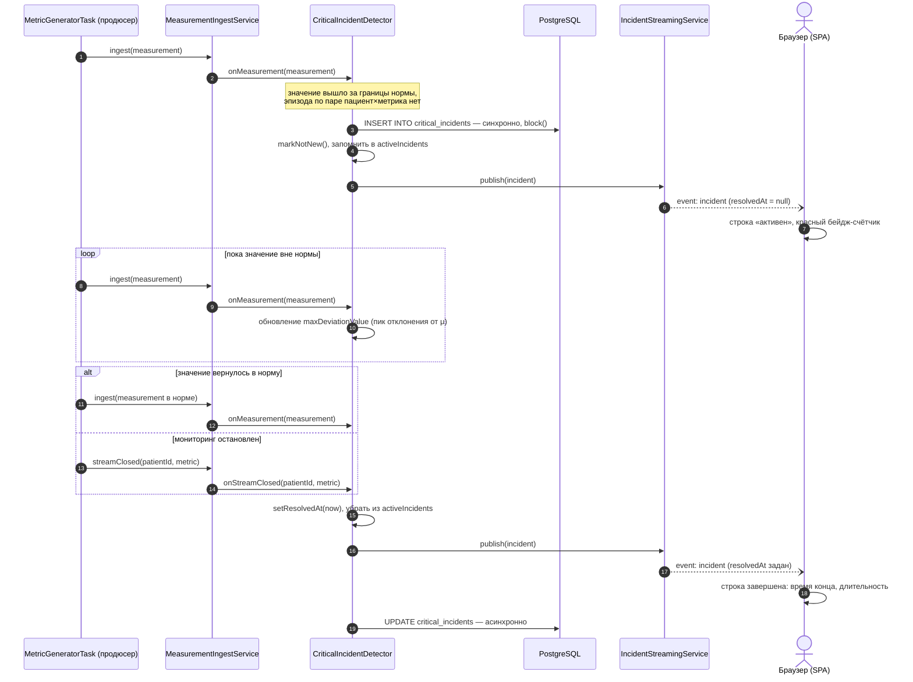

### 2.5. Открытие карточки пациента

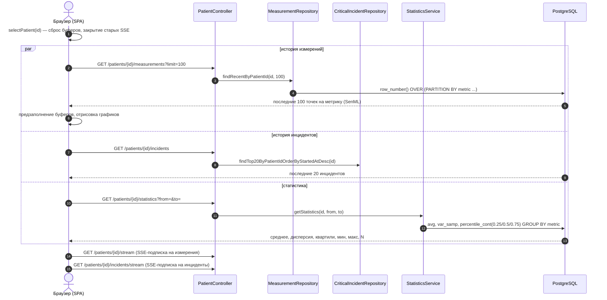

### 2.6. Восстановление мониторинга после перезапуска

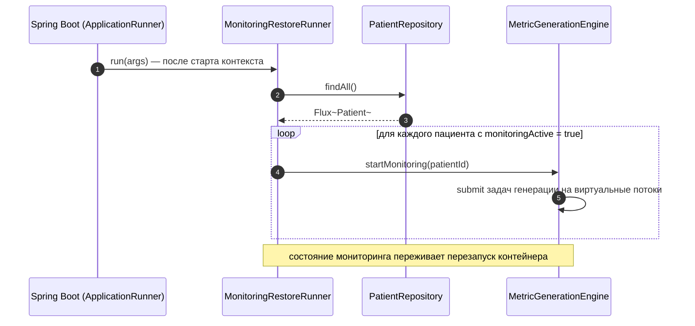

---

## 3. C4-диаграммы

Mermaid C4 ограничен, поэтому C4-диаграммы выполнены на **PlantUML + C4-PlantUML**
(стандарт de facto для C4): файлы `c4-context.puml`, `c4-container.puml`,
`c4-component.puml` в корне проекта. Рядом лежат уже отрендеренные
`c4-context.svg`, `c4-container.svg`, `c4-component.svg` — их можно открыть
без каких-либо инструментов.

### Рендеринг C4-диаграмм

Любой из способов:

**Docker (ничего не устанавливая):**
```bash
docker run --rm -v "$PWD":/data plantuml/plantuml -tsvg /data/c4-context.puml /data/c4-container.puml /data/c4-component.puml
```
SVG-файлы появятся рядом с исходниками.

**IntelliJ IDEA / VS Code:** плагин «PlantUML Integration» (IDEA) или «PlantUML»
(VS Code, jebbs.plantuml) — предпросмотр по открытию `.puml` файла.

**Онлайн:** содержимое файла → <https://www.plantuml.com/plantuml> или любой
сервер Kroki.

Диаграммы используют `!include` C4-PlantUML по URL, поэтому при первом
рендеринге нужен доступ в интернет (или скачайте `C4*.puml` из
<https://github.com/plantuml-stdlib/C4-PlantUML> рядом и замените включения на
локальные).

---

## 4. ERD сущностей базы данных

Четыре таблицы; `measurements` и `critical_incidents` ссылаются на
`patients` (FK). `users` — изолированная таблица аутентификации.
Первичные ключи доменных сущностей — UUIDv7, присваиваются в приложении.

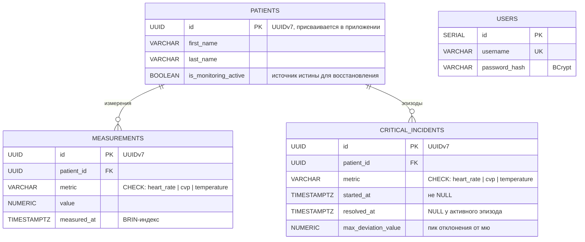
