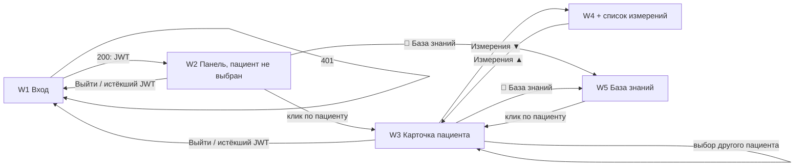

# Wireframe-макеты интерфейса

Низкодетальные макеты панели наблюдения. Источник истины — реализованный
фронтенд (`frontend/index.html`, `frontend/app.js`, `frontend/style.css`):
макеты документируют фактическую структуру экранов и поведение, а не
проектируют новое. Синие маркеры ①②③ — аннотации поведения, расшифровка
в нижней части каждого макета.

| # | Макет | Экран / состояние |
|---|-------|-------------------|
| W1 | [01-login.svg](01-login.svg) | Вход: форма логин/пароль, обработка 401 |
| W2 | [02-dashboard-empty.svg](02-dashboard-empty.svg) | Панель после входа: сайдбар с пациентами, форма регистрации, плейсхолдер |
| W3 | [03-patient-card.svg](03-patient-card.svg) | Карточка пациента при активном мониторинге: графики трёх метрик, критическое значение, инциденты, статистика |
| W4 | [04-measurements-expanded.svg](04-measurements-expanded.svg) | Раскрытый список измерений у графика; бейдж активных инцидентов в сайдбаре |
| W5 | [05-knowledge-base.svg](05-knowledge-base.svg) | База знаний: справочник типов ошибок API (RFC 9457) с поиском и фильтром по статусу |

## Карта экранов

## Состояния, не вынесенные в отдельные макеты

- **Мониторинг на паузе** (W3): индикатор «поток не активен», доступна
  кнопка «Старт», графики показывают только историю, новые точки не приходят.
- **Нет данных за интервал** (W3, статистика): все ячейки метрики — «—».
- **Переподключение SSE** (W3): статус «переподключение…», авто-retry каждые 2 с.
- **Пустая история инцидентов** (W3): текст «Инцидентов не зафиксировано».

## Соответствие требованиям

| Элемент макета | Требование ТЗ |
|---|---|
| W1 форма входа | аутентификация JWT (RFC 7519/6750) |
| W2 форма «+ Добавить», список с бейджами | регистрация пациентов, статус мониторинга |
| W3 кнопки Старт/Стоп | управление мониторингом (защита от двойного клика) |
| W3 графики с зоной нормы | отображение показателей в реальном времени |
| W3/W4 история при открытии | «не менее десяти последних измерений» |
| W3 таблица статистики | среднее, дисперсия, квартили на выбранном интервале |
| W3 секция инцидентов + W4 бейдж | фиксация и отображение критических инцидентов |
| W5 база знаний | единый формат ошибок (RFC 9457) с типами и инструкциями по устранению |
